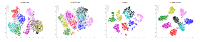
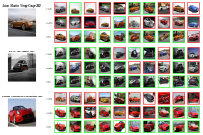

## **MaskCon: Masked Contrastive Learning for Coarse-Labelled Dataset**

<p align="center">
    
</p>

[](https://paperswithcode.com/sota/learning-with-coarse-labels-on-cifar100?p=maskcon-masked-contrastive-learning-for)
[](https://paperswithcode.com/sota/learning-with-coarse-labels-on-stanford-cars?p=maskcon-masked-contrastive-learning-for)
[](https://paperswithcode.com/sota/learning-with-coarse-labels-on-stanford?p=maskcon-masked-contrastive-learning-for)
[](https://paperswithcode.com/sota/learning-with-coarse-labels-on-imagenet32?p=maskcon-masked-contrastive-learning-for)

This is the official PyTorch implementation of CVPR2023 paper  ([MaskCon: Masked Contrastive Learning for Coarse-Labelled Dataset](https://arxiv.org/abs/2303.12756)). 

### Abstract
Deep learning has achieved great success in recent years with the aid of advanced neural network structures and large-scale human-annotated datasets. However, it is often costly and difficult to accurately and efficiently annotate large-scale datasets, especially for some specialized domains where fine-grained labels are required. In this setting, coarse labels are much easier to acquire as they do not require expert knowledge. In this work, we propose a contrastive learning method, called *Mask*ed *Con*trastive learning~(*MaskCon*) to address the under-explored problem setting, where we learn with a coarse-labelled dataset in order to address a finer labelling problem. More specifically, within the contrastive learning framework, for each sample our method generates soft-labels against other samples and another augmented view of the sample in question. By contrast to self-supervised contrastive learning where only the sample's augmentations are considered hard positives, and in supervised contrastive learning where only samples with the same coarse labels are considered hard positives, we propose soft labels based on sample distances, that are masked by the coarse labels. This allows us to utilize both inter-sample relations and coarse labels. We demonstrate that our method can obtain as special cases many existing state-of-the-art works and that it provides tighter bounds on the generalization error. 
Experimentally, our method achieves significant improvement over the current state-of-the-art in various datasets, including CIFAR10, CIFAR100, ImageNet-1K, Standford Online Products and Stanford Cars196 datasets.
### Preparation
- pytorch
- tqdm
- wandb

Please considering cite our paper if you find this repo useful:
```bibtex
@InProceedings{Feng_2023_CVPR,
    author    = {Feng, Chen and Patras, Ioannis},
    title     = {MaskCon: Masked Contrastive Learning for Coarse-Labelled Dataset},
    booktitle = {Proceedings of the IEEE/CVF Conference on Computer Vision and Pattern Recognition (CVPR)},
    month     = {June},
    year      = {2023},
    pages     = {19913-19922}
}
```

### Usage
Example runs on imagenet/SOP/Cars dataset:
```
python main.py --dataset imagenet32 --data_path ../datasets/imagenet32 --wandb_id imagenet32 --K 16384 --m 0.99 --t0 0.1 --t 0.05 --w 1.0 --mode coins --gpu_id 0 --epochs 100 --aug_q strong --aug_k weak --batch_size 256

python main.py --dataset sop_split1 --data_path ../datasets/Stanford_Online_Products --wandb_id Stanford_Online_Products_Split1 --t0 0.1 --t 0.1 --w 0.8 --mode maskcon --gpu_id 0 --aug_q strong --aug_k weak

python main.py --dataset cars196 --data_path ../datasets/StanfordCars --wandb_id StanfordCars --w 1.0 --t 0.1 --w 1.0 --mode maskcon --gpu_id 1 --aug_q strong --aug_k weak
```

### Visualizations
tSNE visualization of learned features on the CIFARtoy test set:
<p align="center">
    
</p>


### Results
Top-10 retrieved images on the Cars196 test set:
<p align="center">
    
</p>


### Usage of coarse labels
We provide all the coarse labels of downsampled imagenet dataset and Stanford Online Products dataset in coarse_labels dir.
- For Cars196 and CIFARtoy dataset, feel free to copy our dataloaders for your project.
- For SOP dataset, please copy and paste the `coarse_labels/sop_split1` and `coarse_labels/sop_split2` directory to the dataset path.
- For ImageNet32 dataset, please copy and paste the `coarse_labels/imagenet32/imagenet32_to_fine.json` and `coarse_labels/imagenet32/imagenet_fine_to_coarse.json` files to the dataset path.


### License
This project is licensed under the terms of the MIT license.
